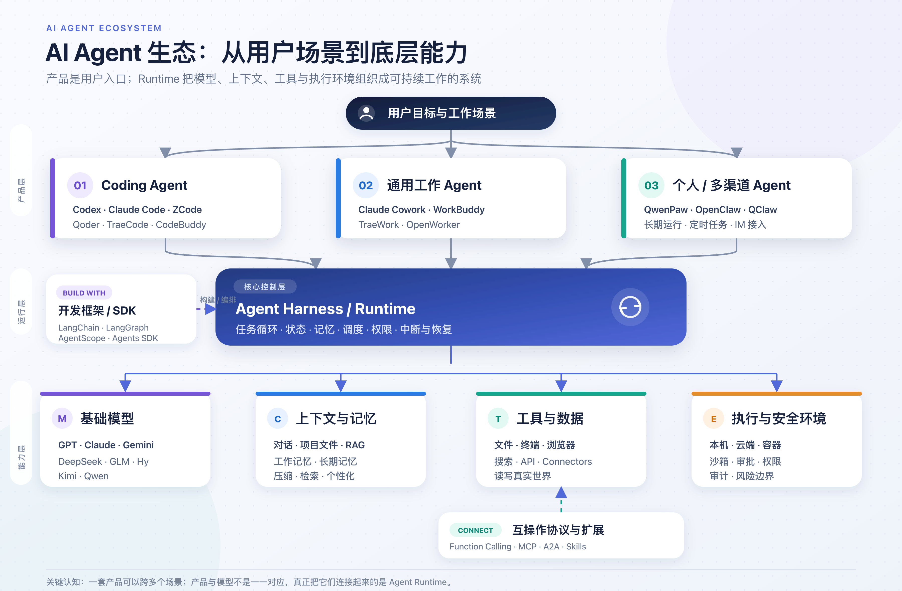

# 从大模型到 AI Agent：一文捋清模型、产品、框架与协议

随着大模型能力不断演进，围绕模型、Agent、产品与框架的新概念和新产品层出不穷。最初接触这些内容时，我容易把模型、面向用户的 Agent 产品，以及支撑它们运行的框架、Runtime 和协议混在一起，也会把产品之间的“兼容”误认为“底层基于”。

这次在与 Codex 对话并查阅相关资料后，我重新梳理了这些概念之间的关系，希望用这篇笔记建立一张从基础模型、通用助手到 Agent 产品与开发技术栈的全景图。它不追求穷举产品，也不展开具体的功能评测，而是先回答一个更基础的问题：这些名字分别处在哪一层，它们之间又是如何组合起来的？

## 第一层：基础模型

这层提供“理解、推理和生成能力”。

| 公司/团队 | 模型家族 |
|---|---|
| OpenAI | GPT、o 系列、Codex 专用模型等 |
| Anthropic | Claude |
| Google | Gemini |
| DeepSeek | DeepSeek V/R 等系列 |
| 智谱/Z.ai | GLM |
| 腾讯 | Hy，即国内所称的混元 |
| 月之暗面 | Kimi |
| 阿里 | Qwen，通义千问 |
| MiniMax | MiniMax 系列 |

这里要注意：很多名称既是模型品牌，也是产品品牌。

- GPT 是模型，ChatGPT 是产品。
- Claude 既可以指模型家族，也可以指 Claude 应用。
- Gemini、DeepSeek、Kimi、Qwen 也存在类似的品牌重叠。

模型可以生成普通文本，也可以生成结构化的 Tool Call，但它自己通常不负责真正打开文件、执行命令或访问企业系统。

## 第二层：通用 AI 助手产品

这类产品主要以“对话”为入口：

- ChatGPT
- Claude
- Gemini
- DeepSeek
- Kimi
- 腾讯元宝
- 通义/Qwen

它们过去主要是 Chatbot，现在普遍开始加入搜索、文件处理、深度研究、代码执行和 Computer Use，因此与 Agent 产品的边界越来越模糊。

可以把它们理解为：

> 以对话和内容生成为中心，逐渐增加 Agent 能力的综合 AI 应用。

## 第三层：Agent 产品

Agent 产品强调的不是“回答问题”，而是“接收目标并完成任务”。

### 1. Coding Agent

主要操作代码仓库、终端、Git、测试和浏览器。

- Codex：OpenAI 的 Coding Agent 产品族，覆盖桌面、CLI、IDE 和云端。[OpenAI Docs](https://developers.openai.com/codex)
- Claude Code：Anthropic 的开发 Agent，最初以终端为主要入口。
- ZCode：围绕 GLM 深度优化的 Agentic Development Environment。
- Qoder：覆盖 IDE、CLI、桌面和移动端的 Agentic Coding 平台。
- TraeCode：TRAE 体系中偏专业软件开发的一侧。
- CodeBuddy：腾讯的 Coding Agent 产品族，覆盖 IDE、插件、CLI 和 Agent 平台。

这些统称为“Agentic Coding 产品”比单纯叫 Coding Agent 更准确，因为它们的产品形态并不相同。

### 2. 通用工作 Agent / AI Coworker

主要处理文档、表格、PPT、研究、数据分析和跨应用办公任务。

- Claude Cowork
- WorkBuddy
- TraeWork
- OpenWorker
- 部分情况下也包括现在的 Codex

这类产品的核心是：

> 用户描述结果，Agent 自己拆解步骤，并最终交付文件或完成外部操作。

### 3. 个人 Agent / 自托管 Agent

强调长期运行、个人记忆、定时任务和聊天渠道接入。

- OpenClaw
- QwenPaw
- QClaw
- OpenWorker 也部分属于这一类

它们往往支持 Telegram、微信、钉钉、飞书、Slack 等渠道，并能在后台持续运行。

因此“桌面 Agent”和“个人 Agent”并不是互斥分类：QwenPaw 有桌面应用，但整体定位比普通桌面助手更宽；OpenWorker 既是桌面 Coworker，也具备自动化和持续运行能力。

## 第四层：Agent Framework、SDK、Harness 和 Runtime

这是最容易混在一起的一层。

### Framework / SDK

主要给开发者提供编程抽象：

- LangChain：模型、工具、Agent、Middleware 等高层抽象。
- AgentScope：Agent、工具、状态、多 Agent、评测等完整开发体系。
- OpenAI Agents SDK
- Claude Agent SDK
- Google ADK
- AutoGen、CrewAI 等

判断方法：如果主要使用方式是“安装依赖、导入代码、编写自己的 Agent”，它更接近 Framework 或 SDK。

### Orchestration / Runtime

负责 Agent 实际运行：

- LangGraph：状态图、循环、持久化、恢复、Human-in-the-loop。
- AgentScope Runtime：部署、Session、Sandbox、Service。
- OpenClaw Runtime：模型调用、工具执行、Session、渠道和记忆。
- OpenWorker 自己的 Python Agent Runtime。

判断方法：如果它负责“任务怎样持续执行、失败怎样恢复、工具怎样调用、状态怎样保存”，它更接近 Runtime。

### Agent Harness

Harness 可以理解为模型周围的“控制程序”：

1. 收集上下文。
2. 调用模型。
3. 解析模型返回的 Tool Call。
4. 执行工具。
5. 把结果交还模型。
6. 循环直到任务完成。

Codex、Claude Code、OpenClaw、OpenWorker 都有自己的 Agent Harness，只是开放程度不同。

## 第五层：协议与扩展机制

它们不是 Agent 框架。

- Function Calling：模型输出结构化工具调用请求的能力。
- MCP：标准化 Agent 与工具、数据源的连接。[MCP 规范](https://modelcontextprotocol.io/specification/2025-06-18)
- A2A：标准化独立 Agent 之间的发现、委派和通信。
- Skills：把指令、脚本、参考资料和资源组织成可复用能力包；目前不同生态的具体格式不完全一致。
- Connector：某个产品对 Gmail、Slack、GitHub、Notion 等服务的具体集成。

可以简单记成：

> MCP 给 Agent 接工具，A2A 让 Agent 接 Agent，Skills 教 Agent 怎么做特定任务。

## 第六层：模型与运行基础设施

这部分也经常被叫作“AI 框架”，但它与 LangChain 不是同一类东西。

- PyTorch：模型训练和计算框架。
- Transformers：模型结构、权重加载和推理开发。
- vLLM、SGLang：模型推理与服务。
- Ollama：本地模型运行和管理。
- CUDA、GPU、Kubernetes：更底层的计算与部署基础设施。

所以以后最好区分：

- 模型框架
- 推理框架
- Agent 框架
- Agent Runtime

不要统一叫“AI 框架”。

## 几条具体的产品关系

| 上层产品 | 模型关系 | Agent 技术关系 |
|---|---|---|
| Codex | 主要使用 OpenAI 模型 | OpenAI 自有 Agent Runtime/Harness |
| Claude Code / Cowork | 使用 Claude 模型 | Anthropic 自有 Agent Runtime |
| ZCode | 与 GLM 深度集成 | ZCode 自研 Agent |
| WorkBuddy | 支持 Hy、GLM、Kimi、DeepSeek 等多模型 | 腾讯自研，不是基于 OpenClaw |
| QClaw | 支持多模型 | 基于 OpenClaw |
| QwenPaw | 名字叫 QwenPaw，但可以接入多种模型 | AgentScope + AgentScope Runtime + ReMe |
| OpenClaw | 模型无关 | 自带完整 Agent Runtime |
| OpenWorker | 支持 OpenAI、Claude、Gemini、GLM、Kimi、Qwen 等 | aisuite + OpenWorker 自研 Runtime |
| LangChain/LangGraph | 可接不同公司的模型 | 用来开发 Agent，本身不是最终用户产品 |

OpenWorker 的这层关系可以直接在仓库说明中看到：[README.md](https://github.com/andrewyng/openworker/blob/2270197838a754a72aa9ea101ef87e39efef9ff7/README.md#L44-L55)。

最后，把整套关系压缩成一句话：

> GPT、Claude、GLM、Hy 等是提供智能的基础模型；Codex、Claude Code、WorkBuddy、OpenWorker 等是用户直接使用的 Agent 产品；LangChain、LangGraph、AgentScope 等是开发和运行 Agent 的技术；MCP、A2A、Skills 负责把 Agent 与工具、其他 Agent 和专业能力连接起来。
