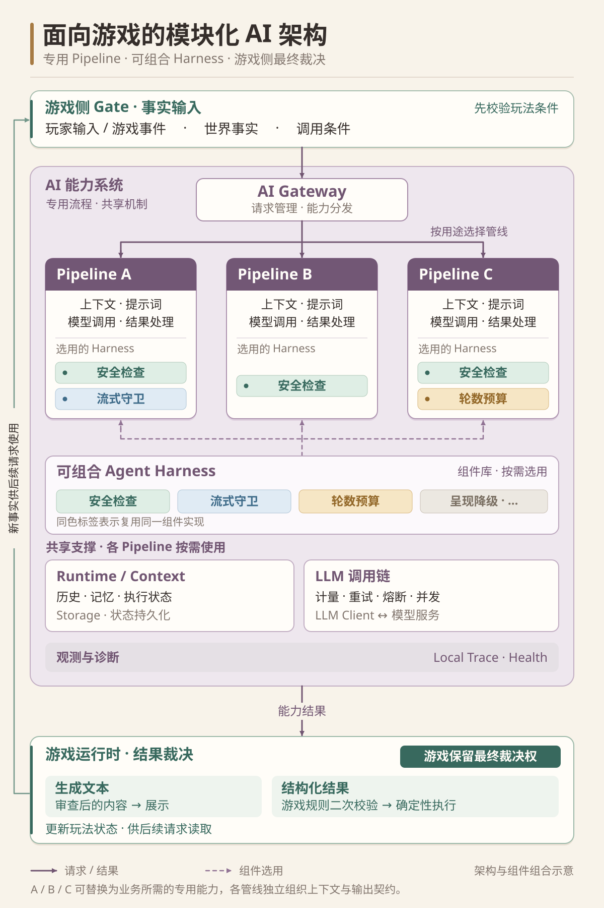

# 为游戏设计一套 AI 系统：专用 Pipeline 与可组合 Harness

## 为什么为游戏单独设计一套 AI 系统

游戏接入多种 AI 能力后，需要同时处理两件事：各项能力能够独立演进，公共机制能够复用。我们用专用 Pipeline 组织能力，再按需组装可复用的 Agent Harness。

另一个设计前提是，AI 不可用时，游戏整体仍应能够继续运行。依赖 AI 的玩法可能受到影响，甚至暂时不可用，但不应阻断整个游戏。因此，游戏与 AI 之间需要保留清晰的职责边界。

## 三个设计思想

这套架构围绕三个设计思想展开。

### 思想一：AI 应当是逻辑独立的能力系统

AI 与游戏通过结构化的事实和结果契约协作。职责分离既涉及逻辑，也涉及状态：哪些逻辑由游戏侧完成，哪些状态由游戏客户端保存，哪些上下文和记忆由 AI 侧管理，都需要约定清楚。这些约定构成双方的协作边界，减少对具体游戏对象、UI 和内部状态实现的直接依赖。

### 思想二：用专用 Pipeline 组织明确用途的 AI 能力

这套架构面向用途明确、可以列举和约束的 AI 能力。我们为每项专用能力分别设计一条 Pipeline，也就是一套负责组织该能力所需上下文、提示词、模型调用与结果处理的独立流程，让模型在有限的问题空间中专注完成当前任务。

### 思想三：通用能力应当拆成可组合的 Harness

在这套设计中，Agent 可以理解为 LLM 与其外围 Harness 共同组成的系统。不同 AI 能力各自组织专用流程，同时复用支持模型稳定工作的公共机制。

Pi 的扩展与包机制以及 DeepSeek Harness 的插件与服务架构，为这种组件化设计提供了启发。我们采用其中“将能力拆开，再按需要组合”的思路：安全、韧性和计量等 Harness 组件是大部分 Pipeline 都需要的公共能力；而轮数预算、流式输出守卫等组件，则只在特定的 AI 能力中使用。

我们将 Harness 的不同能力拆成组件，再由各条 Pipeline 根据自身需要进行组装。

## AI 总体架构

游戏提供事实并发起请求，统一入口将请求分发给对应 Pipeline。各条管线组织专用流程、选用共享组件，并将结果交回游戏校验和使用。

> 图 1：AI 总体架构

通用的是 Agent Harness，专用的是能力 Pipeline，而游戏运行时始终保留最终裁决权。

## 这种分工带来的好处

公共组件可以集中维护，各条 Pipeline 的提示词、上下文和输出约束可以分别调整。需要独立流程的新能力，也有明确的接入位置。

程序队友可以沿用现有接口、复用 Harness 组件扩展能力；策划队友在理解框架和职责边界后，也可以借助 Coding Agent 参与开发。
