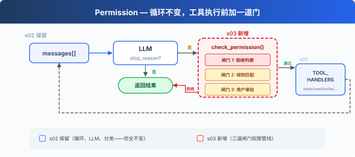
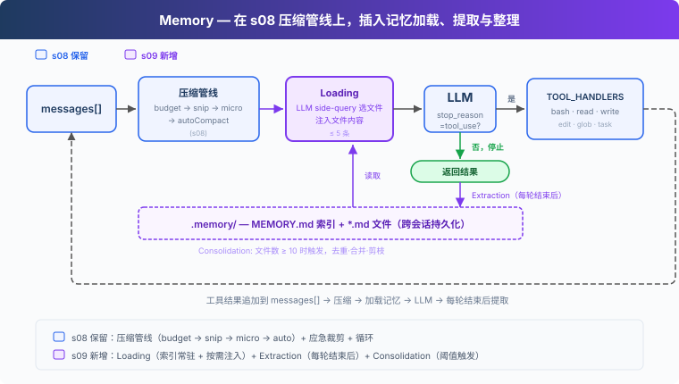
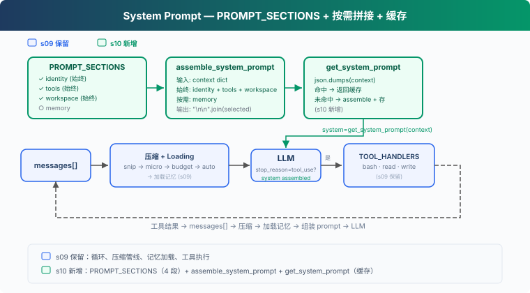

# learn-claude-code 学习记录：从 Agent Loop 到 MCP Tools

记录自己在过一遍`learn-claude-code`项目时自己困惑或想要记录的点。学习的重心放在 Harness 工程上。

项目地址：https://github.com/shareAI-lab/learn-claude-code

:::note 阅读信息

- 来源项目：[shareAI-lab/learn-claude-code](https://github.com/shareAI-lab/learn-claude-code)
- 初次整理：2026.05.21
- 更新日期：2026.05.25
- 更新说明：项目学习文档从 12 章扩展到 20 章，本次补充整理新增章节；汇总章节未单独学习。
- 主题标签：Claude Code、Coding Agent、Harness、Agent Loop、MCP Tools

:::

## s01: The Agent Loop (Agent 循环)

**Harness 层**: 循环 -- 模型与真实世界的第一道连接。

实际上 Agent Loop 就是一个 ReAct-like 的执行过程。如果只是单次调用模型就能得到答案，那么得到 response 后其实即可完成任务。能进入循环，更多的是需要进行 tool use 来探索具体的信息，因此使用了

```python
if response.stop_reason != "tool_use":
    return
```

而 tool_use 的产生，更多是模型侧在训练和对齐之后具备的一种能力。

Claude 这类模型在训练/对齐阶段已经学会了：

> 当我需要外部信息或外部动作时，不要只用自然语言回答，而是按照工具调用格式请求工具。

也就是说，“决定要不要调用工具”这一步，是模型根据当前上下文、用户需求以及可用工具自己推理出来的。如果它判断需要使用工具，就会输出一个符合工具调用协议的结构化内容。

随后 API 会把这个工具调用意图封装成类似这样的响应结构：

```python
response.content = [
    {
        "type": "tool_use",
        "id": "toolu_xxx",
        "name": "bash",
        "input": {
            "command": "ls"
        }
    }
]

response.stop_reason = "tool_use"
```

所以，模型并不是简单地返回一句“我要使用工具”，而是返回了一个结构化的“行动请求”。API 再通过 response.content 中的 tool_use block，以及 response.stop_reason == "tool_use"，告诉 harness：这一轮模型需要你执行工具。

因此，tool_use 能成立的前提，是模型本身已经具备理解工具协议、选择工具、生成工具参数的能力；而 harness 的职责，是识别这个结构化请求，执行对应工具，并把执行结果再喂回模型。

## s02: Tool Use (工具使用)

**Harness 层**: 工具分发 -- 扩展模型能触达的边界。

1. **每个工具有一个处理函数。路径沙箱防止逃逸工作区。**

```python
def safe_path(p: str) -> Path:
    path = (WORKDIR / p).resolve()
    if not path.is_relative_to(WORKDIR):
        raise ValueError(f"Path escapes workspace: {p}")
    return path

def run_read(path: str, limit: int = None) -> str:
    text = safe_path(path).read_text()
    lines = text.splitlines()
    if limit and limit < len(lines):
        lines = lines[:limit]
    return "\n".join(lines)[:50000]
```

路径沙箱可以理解为：这个 agent 的文件工具只能在项目目录里活动，不能读/写项目外面的文件。

假设工作目录为

```python
WORKDIR = Path("/Users/djtang/learn-claude-code")
```

则 agent 可读目录

```
README-zh.md
docs/zh/s01-the-agent-loop.md
agents/s01_agent_loop.py
```

但是不应该能读

```
/etc/passwd
../../Desktop/private.md
/Users/djtang/.ssh/id_rsa
```

这个就叫“防止逃逸工作区”：用户或模型传入一个路径时，试图通过绝对路径或`..`来跳出当前目录。

在这段代码中，`safe_path`拼接最终的绝对路径，并判断绝对路径是否在工作目录内。如果在工作目录外就抛出错误。

在`run_read`中，先通过`safe_path`防止逃逸工作区，随后再将文本进行裁剪并传回。裁剪的目的是为了避免一次性传入大量的上下文。

2. **dispatch map 将工具名映射到处理函数。**

```python
TOOL_HANDLERS = {
    "bash":       lambda **kw: run_bash(kw["command"]),
    "read_file":  lambda **kw: run_read(kw["path"], kw.get("limit")),
    "write_file": lambda **kw: run_write(kw["path"], kw["content"]),
    "edit_file":  lambda **kw: run_edit(kw["path"], kw["old_text"],
                                        kw["new_text"]),
}
```

3. **循环中按名称查找处理函数。循环体本身与 s01 完全一致。**

```python
for block in response.content:
    if block.type == "tool_use":
        handler = TOOL_HANDLERS.get(block.name)
        output = handler(**block.input) if handler \
            else f"Unknown tool: {block.name}"
        results.append({
            "type": "tool_result",
            "tool_use_id": block.id,
            "content": output,
        })
```

总结一下，``TOOLS`` 是给模型看的工具说明书，``TOOL_HANDLERS`` 是给 harness 执行用的函数映射表。

在代码

```python
response = client.messages.create(
    model=MODEL,
    system=SYSTEM,
    messages=messages,
    tools=TOOLS,
    max_tokens=8000,
)
```

这里的`TOOLS`负责告诉模型现在有哪些工具可以用，每个工具叫什么，能做什么，需要哪些参数。

模型如果决定调用工具，就会返回一个结构化的 tool_use，比如：

```python
{
    "type": "tool_use",
    "name": "read_file",
    "input": {
        "path": "README.md"
    }
}
```

拿到对应的 name 后，在 Agent 工作时通过 TOOL_HANDLERS 找到真正的 Python 函数并执行。

这样子实现后在新增工具时，不需要改 agent loop，只需要加工具定义和 handler 映射。

## s03: TodoWrite (待办写入)

**Harness 层**: 规划 -- 让模型不偏航, 但不替它画航线。

Agent 执行得越久，其堆积的上下文就会越多，在进行多步骤的任务时做到最后可能会出现重复做事、跳步、跑偏的情况。因为在上下文越来越多的情况下，最开始的系统提示词的注意力权重可能就会越变越稀薄。因此在多步任务中，需要对流程进行管理。

1. TodoManager 存储带状态的项目。同一时间只允许一个 `in_progress`。

```python
class TodoManager:
    def update(self, items: list) -> str:
        validated, in_progress_count = [], 0
        for item in items:
            status = item.get("status", "pending")
            if status == "in_progress":
                in_progress_count += 1
            validated.append({"id": item["id"], "text": item["text"],
                              "status": status})
        if in_progress_count > 1:
            raise ValueError("Only one task can be in_progress")
        self.items = validated
        return self.render()
```

设定一个 TodoManager 的类，用于维护一个 todo 的列表。 Agent 可以有很多的待办事项，但是正在做的事项只能够有一个，即确保同一时间只有一个任务在`in_progress`。

如果校验通过，就把整理好的 todo 列表保存到对象里。也就是说，TodoManager 的内部状态被更新了。

2. `todo` 工具和其他工具一样加入 dispatch map。

```python
TOOL_HANDLERS = {
    # ...base tools...
    "todo": lambda **kw: TODO.update(kw["items"]),
}
```

3. nag reminder: 模型连续 3 轮以上不调用 `todo` 时注入提醒。

```python
if rounds_since_todo >= 3 and messages:
    last = messages[-1]
    if last["role"] == "user" and isinstance(last.get("content"), list):
        last["content"].insert(0, {
            "type": "text",
            "text": "<reminder>Update your todos.</reminder>",
        })
```

这里的 todo 是脱离模型、存在于 harness 里的外部状态对象。

也就是代码里会有

```python
TODO = TodoManager()
```

模型本身不会真的“保存”一个稳定的 todo list。模型每一轮只是根据当前 messages 推理下一步该做什么。真正长期保存 todo 状态的是 harness 里的 TODO.items。

所以具体的工作流程可以理解为：

1. harness 提供一个 todo 工具
2. system prompt 要求模型在多步任务中使用 todo
3. 模型根据用户任务生成 todo list
4. 模型通过 tool_use 调用 todo 工具，把 items 传给 harness
5. harness 用 TodoManager 校验并保存这些 items
6. 后续模型继续通过 tool_use 更新这个 todo 状态

所以不是“设定成 todo 模型”，而是产品/harness 设计了一个叫 todo 的外部工具和状态容器，然后引导模型把计划写进去。

模型负责：拆任务、决定当前步骤、更新状态；

harness 负责：提供 todo 工具、校验格式、保存 todo list、限制只能一个 in_progress、把当前 todo 状态作为 tool_result 返回给模型。

计划并不是只存在于对话记录里的上下文，而是一个可写入、可检查、可持续维护的对象。

## s04: Subagents (Subagent)

**Harness 层**: 上下文隔离 -- 守护模型的思维清晰度。

当我们使用 Agent 越久的时候，上下文就会不断变得臃肿，message 里便会越来越多内容。例如每次读文件、跑命令的结果的输出都会永久地存在于上下文之中。

例如一个需求“这份代码使用的是什么框架？”这个时候可能需要读 5 个文件，但是实际上存储在上下文只需要存储“pytest”就够了，而非这 5 个文件的工具调用记录以及结果。

很多工具调用只是为了中间调查。中间材料对子 agent 有用，但对父 agent 没必要长期保留。subagent 的价值，就是隔离这些临时上下文，只把压缩后的结论交回父 agent。

这就是“上下文隔离”。父 agent 保持干净，子 agent 负责脏活累活。

1. 父 Agent 有一个 `task` 工具。Subagent 拥有除 `task` 外的所有基础工具 (禁止递归生成)。

```python
PARENT_TOOLS = CHILD_TOOLS + [
    {"name": "task",
     "description": "Spawn a subagent with fresh context.",
     "input_schema": {
         "type": "object",
         "properties": {"prompt": {"type": "string"}},
         "required": ["prompt"],
     }},
]
```

2. Subagent 以 `messages=[]` 启动, 运行自己的循环。只有最终文本返回给父 Agent。

```python
def run_subagent(prompt: str) -> str:
    sub_messages = [{"role": "user", "content": prompt}]
    for _ in range(30):  # safety limit
        response = client.messages.create(
            model=MODEL, system=SUBAGENT_SYSTEM,
            messages=sub_messages,
            tools=CHILD_TOOLS, max_tokens=8000,
        )
        sub_messages.append({"role": "assistant",
                             "content": response.content})
        if response.stop_reason != "tool_use":
            break
        results = []
        for block in response.content:
            if block.type == "tool_use":
                handler = TOOL_HANDLERS.get(block.name)
                output = handler(**block.input)
                results.append({"type": "tool_result",
                    "tool_use_id": block.id,
                    "content": str(output)[:50000]})
        sub_messages.append({"role": "user", "content": results})
    return "".join(
        b.text for b in response.content if hasattr(b, "text")
    ) or "(no summary)"
```

父 agent 可能存在了很多上下文，但是子 agent 不需要继承父 agent 的所有上下文，只需要有 prompt 即可。多余的上下文可能会对子 agent 在工作的时候进行误导，同时这样也能做到上下文隔离。

在 subagent 完成循环后，则返回最后的内容给父 agent。

具体的工作流程为：

1. 子 agent 读文件、跑命令、分析
2. 它不再需要工具时，输出最后一段自然语言
3. system prompt 要求它 summarize your findings
4. run_subagent 只提取这段最终文本
5. 父 agent 只收到这段最终文本

subagent 不是另一个神秘的新模型，而是同一个模型 + 新的 messages 数组 + 受限工具集 + 摘要式返回。

## s05: Skills (Skill 加载)

**Harness 层**: 按需知识 -- 模型开口要时才给的领域专长。

关于 Skills 的认识，之前已经总结过了。总的来说，Agent Skills 是一种通过标准化文件结构，把可复用的智能体能力打包成文件夹的方式，通常包含说明文档、元数据、脚本和资源文件，让不同 AI 编码工具能按相似约定发现、加载和执行这些能力。

这里主要具体开展 Skill 的加载。

1. 每个 Skill 是一个目录, 包含 `SKILL.md` 文件和 YAML frontmatter。

```
skills/
  pdf/
    SKILL.md       # ---\n name: pdf\n description: Process PDF files\n ---\n ...
  code-review/
    SKILL.md       # ---\n name: code-review\n description: Review code\n ---\n ...
```

2. SkillLoader 递归扫描 `SKILL.md` 文件, 用目录名作为 Skill 标识。

```python
class SkillLoader:
    def __init__(self, skills_dir: Path):
        self.skills = {}
        for f in sorted(skills_dir.rglob("SKILL.md")):
            text = f.read_text()
            meta, body = self._parse_frontmatter(text)
            name = meta.get("name", f.parent.name)
            self.skills[name] = {"meta": meta, "body": body}

    def get_descriptions(self) -> str:
        lines = []
        for name, skill in self.skills.items():
            desc = skill["meta"].get("description", "")
            lines.append(f"  - {name}: {desc}")
        return "\n".join(lines)

    def get_content(self, name: str) -> str:
        skill = self.skills.get(name)
        if not skill:
            return f"Error: Unknown skill '{name}'."
        return f"<skill name=\"{name}\">\n{skill['body']}\n</skill>"
```

3. 第一层写入系统提示。第二层不过是 dispatch map 中的又一个工具。

```python
SYSTEM = f"""You are a coding agent at {WORKDIR}.
Skills available:
{SKILL_LOADER.get_descriptions()}"""

TOOL_HANDLERS = {
    # ...base tools...
    "load_skill": lambda **kw: SKILL_LOADER.get_content(kw["name"]),
}
```

SkillLoader 在 harness 启动时先把所有 skill 的“索引”建好：包括 meta 和 body。然后系统提示词里只放轻量的 skill 描述；真正完整的 skill 内容，要等模型通过 load_skill 工具主动请求时，才作为 tool_result 注入上下文。

Harness 在其中只起展示 Skills 目录的作用，具体的 load_skill 的请求，以及指定哪个 Skill，都由模型来决定。

## s06: Context Compact (上下文压缩)

**Harness 层**: 压缩 -- 干净的记忆, 无限的会话。

Claude Code 采用的是三层压缩，激进程度递增：


```
每一轮对话：
+------------------+
|    工具调用结果    |
+------------------+
        |
        v
[第 1 层：micro_compact]        （静默执行，每轮都会发生）
  将超过 3 轮之前的 tool_result
  替换为 "[Previous: used {tool_name}]"
        |
        v
[检查：tokens 是否 > 50000？]
   |                  |
   否                 是
   |                  |
   v                  v
继续运行        [第 2 层：auto_compact]
                  将完整 transcript 保存到 .transcripts/
                  由 LLM 总结当前对话
                  用 [summary] 替换全部 messages
                        |
                        v
                [第 3 层：compact 工具]
                  模型显式调用 compact
                  执行与 auto_compact 相同的总结压缩
```

简单理解，第一层是把旧的、较大的工具结果替换成占位符。也就是保留“之前用过这个工具”的痕迹，但删掉大段内容。

不过源码里有个细节：它会保留最近 3 个工具结果，而且默认不压缩 read_file 的结果。

所以第一层是轻量、静默、每轮执行的“修剪”。

第二层 auto_compact 由代码自动触发。这里不需要模型判断。只要 harness 估算 tokens 超过阈值，就自动压缩。

第三层 compact tool 由模型主动触发。如果模型在推理的过程中判断当前信息很杂，需要压缩，则会自主调用 compact。

1. **第一层 -- micro_compact**: 每次 LLM 调用前, 将旧的 tool result 替换为占位符。

```python
def micro_compact(messages: list) -> list:
    tool_results = []
    for i, msg in enumerate(messages):
        if msg["role"] == "user" and isinstance(msg.get("content"), list):
            for j, part in enumerate(msg["content"]):
                if isinstance(part, dict) and part.get("type") == "tool_result":
                    tool_results.append((i, j, part))
    if len(tool_results) <= KEEP_RECENT:
        return messages
    for _, _, part in tool_results[:-KEEP_RECENT]:
        if len(part.get("content", "")) > 100:
            part["content"] = f"[Previous: used {tool_name}]"
    return messages
```

首先，一个 message 大致上都是长这样：

```python
[
    {"role": "user", "content": "帮我检查项目"},
    {"role": "assistant", "content": [tool_use(...) ]},
    {"role": "user", "content": [
        {
            "type": "tool_result",
            "tool_use_id": "toolu_123",
            "content": "很长很长的命令输出..."
        }
    ]},
]
```

工具结果在 Anthropic 的消息协议里，是作为 user 消息追加回去的。

找到了具体的工具调用位置为第 i 条信息的第 j 个 content 之后，如果工具结果很长，则直接进行压缩替换。

2. **第二层 -- auto_compact**: token 超过阈值时, 保存完整对话到磁盘, 让 LLM 做摘要。

```python
def auto_compact(messages: list) -> list:
    # Save transcript for recovery
    transcript_path = TRANSCRIPT_DIR / f"transcript_{int(time.time())}.jsonl"
    with open(transcript_path, "w") as f:
        for msg in messages:
            f.write(json.dumps(msg, default=str) + "\n")
    # LLM summarizes
    response = client.messages.create(
        model=MODEL,
        messages=[{"role": "user", "content":
            "Summarize this conversation for continuity..."
            + json.dumps(messages, default=str)[:80000]}],
        max_tokens=2000,
    )
    return [
        {"role": "user", "content": f"[Compressed]\n\n{response.content[0].text}"},
    ]
```

3. **第三层 -- manual compact**: `compact` 工具按需触发同样的摘要机制。
4. 循环整合三层:

```python
def agent_loop(messages: list):
    while True:
        micro_compact(messages)                        # Layer 1
        if estimate_tokens(messages) > THRESHOLD:
            messages[:] = auto_compact(messages)       # Layer 2
        response = client.messages.create(...)
        # ... tool execution ...
        if manual_compact:
            messages[:] = auto_compact(messages)       # Layer 3
```

完整历史通过 transcript 保存在磁盘上。信息没有真正丢失, 只是移出了活跃上下文。

## s07: Task System (任务系统)

**Harness 层**: 持久化任务 -- 比任何一次对话都长命的目标。

其实在 s03 中已经做了一个 TodoList，但是这里的 todo 更多是一个天然的 list 顺序，即队列执行顺序。但是实际上现实中的任务，很多都并非是简单的队列顺序就能完成，而是一个 DAG 图，有相互的依赖关系。

```
任务图 (DAG):
                 +----------+
            +--> | task 2   | --+
            |    | pending  |   |
+----------+     +----------+    +--> +----------+
| task 1   |                          | task 4   |
| completed| --> +----------+    +--> | blocked  |
+----------+     | task 3   | --+     +----------+
                 | pending  |
                 +----------+

顺序:   task 1 必须先完成, 才能开始 2 和 3
并行:   task 2 和 3 可以同时执行
依赖:   task 4 要等 2 和 3 都完成
状态:   pending -> in_progress -> completed
```

例如上面的四个 tasks 中，task 2 和 task 3 必须等 task 1 完成后才能够执行。同时 task 2 和 task 3 能够并行处理。而 task 4 必须等前两个任务同时完成后才能够执行。

所以解决方案是把扁平清单升级为持久化到磁盘的**任务图**。每个任务是一个 JSON 文件, 有状态、前置依赖 (`blockedBy`)。任务图随时回答三个问题:

\- **什么可以做?** -- 状态为 `pending` 且 `blockedBy` 为空的任务。

\- **什么被卡住?** -- 等待前置任务完成的任务。

\- **什么做完了?** -- 状态为 `completed` 的任务, 完成时自动解锁后续任务。

这里的“持久化”的意思，即是任务不再只存在于 Python 进程内存里的 self.items，而是写成文件保存到项目目录下。这样即使上下文压缩、程序重启、另一个agent接手的情况都能够持续存在任务状态。同时在持久化的过程中，也会保存对应的前置依赖 (`blockedBy`)。

例如上述任务可被持久化成

```
.tasks/
  task_1.json  {"id":1, "status":"completed"}
  task_2.json  {"id":2, "blockedBy":[1], "status":"pending"}
  task_3.json  {"id":3, "blockedBy":[1], "status":"pending"}
  task_4.json  {"id":4, "blockedBy":[2,3], "status":"pending"}
```

1. **TaskManager**: 每个任务一个 JSON 文件, CRUD + 依赖图。

```python
class TaskManager:
    def __init__(self, tasks_dir: Path):
        self.dir = tasks_dir
        self.dir.mkdir(exist_ok=True)
        self._next_id = self._max_id() + 1

    def create(self, subject, description=""):
        task = {"id": self._next_id, "subject": subject,
                "status": "pending", "blockedBy": [],
                "owner": ""}
        self._save(task)
        self._next_id += 1
        return json.dumps(task, indent=2)
```

当前这段代码只负责创建和保存任务本体，依赖关系的具体建立发生在后面的更新逻辑里。

2. **状态变更 + 依赖关联**: `update` 处理状态转换和依赖边。

```python
def update(self, task_id, status=None,
           add_blocked_by=None, remove_blocked_by=None):
    task = self._load(task_id)
    if status:
        task["status"] = status
        if status == "completed":
            self._clear_dependency(task_id)
    if add_blocked_by:
        task["blockedBy"] = list(set(task["blockedBy"] + add_blocked_by))
    if remove_blocked_by:
        task["blockedBy"] = [x for x in task["blockedBy"] if x not in remove_blocked_by]
    self._save(task)
```

3. **依赖解除**: 完成任务时, 自动将其 ID 从其他任务的 `blockedBy` 中移除, 解锁后续任务。

```python
def _clear_dependency(self, completed_id):
    for f in self.dir.glob("task_*.json"):
        task = json.loads(f.read_text())
        if completed_id in task.get("blockedBy", []):
            task["blockedBy"].remove(completed_id)
            self._save(task)
```

4. 四个任务工具加入 dispatch map。

```python
TOOL_HANDLERS = {
    # ...base tools...
    "task_create": lambda **kw: TASKS.create(kw["subject"]),
    "task_update": lambda **kw: TASKS.update(kw["task_id"], kw.get("status")),
    "task_list":   lambda **kw: TASKS.list_all(),
    "task_get":    lambda **kw: TASKS.get(kw["task_id"]),
}
```

以 tool 的方式给予模型调取 task 的能力，同时 task 相关信息都是持久化到磁盘。这样不仅在单次 Loop 内能够做到持久，在跨多轮对话任务中也能做到持久，只要对应目录存在。

## s08: Background Tasks (后台任务)

**Harness 层**: 后台执行 -- 模型继续思考, harness 负责等待。

一些命令可能需要跑好几分钟: `npm install`、`pytest`、`docker build`。阻塞式循环下模型只能干等。所以提供后台任务形式来进行。

如果 s07 的任务图显示多个任务没有依赖冲突，那么 agent 可以选择并行推进；而 s08 提供的后台任务机制，可以让其中一些耗时命令并行执行。但 s08 并不是多 agent 并行，它只是命令级并行。

1. BackgroundManager 用线程安全的通知队列追踪任务。

```python
class BackgroundManager:
    def __init__(self):
        self.tasks = {}
        self._notification_queue = []
        self._lock = threading.Lock()
```

`threading.Lock()`是Python里的线程锁，用来保护多个线程同时读写同一份共享数据不出问题。

后台任务是通过新建一个线程来完成的，与此同时主线程还在进行 Agent Loop。在这个后台任务管理的过程中，是在不断地维护`_notification_queue`来存储后台任务的结果，每次 Agent Loop 调用大模型之前，都会先读取`_notification_queue`里的内容并清空，然后再作为上下午调用大模型。

如果不使用线程锁进行管理，很有可能就会出现：主线程复制队列——后台任务 append 新通知——主线程 clear 队列。这样子就会缺失信息。因此线程锁的存在就是避免这种事情发生。

2.  `run()` 启动守护线程, 立即返回。

```python
def run(self, command: str) -> str:
    task_id = str(uuid.uuid4())[:8]
    self.tasks[task_id] = {"status": "running", "command": command}
    thread = threading.Thread(
        target=self._execute, args=(task_id, command), daemon=True)
    thread.start()
    return f"Background task {task_id} started"
```

3. 子进程完成后, 结果进入通知队列。

```python
def _execute(self, task_id, command):
    try:
        r = subprocess.run(command, shell=True, cwd=WORKDIR,
            capture_output=True, text=True, timeout=300)
        output = (r.stdout + r.stderr).strip()[:50000]
    except subprocess.TimeoutExpired:
        output = "Error: Timeout (300s)"
    with self._lock:
        self._notification_queue.append({
            "task_id": task_id, "result": output[:500]})
```

`with self._lock:`可以理解为这段代码需要独占访问权。如果锁没人拿，我就拿到锁并执行。如果锁已经被别的线程拿了，我就等待。执行完 with 代码块后，自动释放锁。

4. 每次 LLM 调用前排空通知队列。

```python
def agent_loop(messages: list):
    while True:
        notifs = BG.drain_notifications()
        if notifs:
            notif_text = "\n".join(
                f"[bg:{n['task_id']}] {n['result']}" for n in notifs)
            messages.append({"role": "user",
                "content": f"<background-results>\n{notif_text}\n"
                           f"</background-results>"})
        response = client.messages.create(...)
```

## s09: Agent Teams (Agent 团队)

**Harness 层**: 团队邮箱 -- 多个模型, 通过文件协调。

在 s04 里提及到的 SubAgent 其实是一次性的，当完成了生成、干活、返回结果之后，就会开始消失。没有身份, 没有跨调用的记忆。

同样在 s08 里后台任务只能够跑 shell 命令，并不能成为一个 SubAgent 独立地干活。

真正的团队协作需要三样东西: (1) 能跨多轮对话存活的持久 Agent, (2) 身份和生命周期管理, (3) Agent 之间的通信通道。解决方案就是：持久化队友 + JSONL 邮箱。

什么是邮箱？这里的邮箱平时我们理解的像 Gmail 的那些邮箱系统，这里的 JSONL 邮箱指的是：用本地文件模拟一个 agent 的收件箱。比如：

```
.team/inbox/
  alice.jsonl
  bob.jsonl
  lead.jsonl
```

每个 agent 都有单独属于自己的收件箱文件

```
alice 的邮箱 = .team/inbox/alice.jsonl
bob 的邮箱 = .team/inbox/bob.jsonl
lead 的邮箱 = .team/inbox/lead.jsonl
```

JSONL 是 “JSON Lines” 的意思：每一行都是一个独立的 JSON 对象。它不是一个完整 JSON 数组，而是一行为一条消息，一条消息就是一个 JSON 对象。

为什么使用 JSONL？因为其很适合“追加信息”，发送消息时不需要阅读整篇文章，直接在末尾追加一行数据即可。读取信息可以一次读完所有信息并清零。因此这里的邮箱更像是本地文件版消息队列，解决了多 Agent 之间的通信问题。

```
Teammate生命周期：
  创建 -> 工作中 -> 空闲 -> 工作中 -> ... -> 关闭

通信机制：
  .team/
    config.json           <- 团队名册 + 成员状态
    inbox/
      alice.jsonl         <- 只追加写入，读取后清空
      bob.jsonl
      lead.jsonl

              +--------+    send("alice", "bob", "...")   +--------+
              | alice  | -------------------------------> |  bob   |
              | 循环中 |    bob.jsonl << {一行 JSON 消息}  | 循环中 |
              +--------+                                  +--------+
                   ^                                           |
                   |          BUS.read_inbox("alice")          |
                   +---- alice.jsonl -> 读取 + 清空 ------------+
```

这里的 Teammate 不像是 s04 一样，用完一次则会消失，而是会将其名字、角色、状态保存到`.tea/config.json`里进行持续化。所以一个 Teammate 可以经历：被创建、工作、空闲、被调用工作……被关闭 的过程。

其次是 agent 之间的通信就是通过维护各自的 JSONL 文件进行。例如上述在 Alice 的循环中，如果需要传递信息给 Bob，则在其 JSONL 文件中追加一条信息。在 Bob 的循环中，其会读取邮箱中的信息，然后再清空邮箱。

1. TeammateManager 通过 config.json 维护团队名册。

```python
class TeammateManager:
    def __init__(self, team_dir: Path):
        self.dir = team_dir
        self.dir.mkdir(exist_ok=True)
        self.config_path = self.dir / "config.json"
        self.config = self._load_config()
        self.threads = {}
```

2. `spawn()` 创建队友并在线程中启动 agent loop。

```python
def spawn(self, name: str, role: str, prompt: str) -> str:
    member = {"name": name, "role": role, "status": "working"}
    self.config["members"].append(member)
    self._save_config()
    thread = threading.Thread(
        target=self._teammate_loop,
        args=(name, role, prompt), daemon=True)
    thread.start()
    return f"Spawned teammate '{name}' (role: {role})"
```

创建一个后台线程。这个线程启动后会运行 self._teammate_loop(name, role, prompt)。它是 daemon 线程，所以主程序退出时不会等它，线程会随程序一起结束。

3. MessageBus: append-only 的 JSONL 收件箱。`send()` 追加一行; `read_inbox()` 读取全部并清空。

```python
class MessageBus:
    def send(self, sender, to, content, msg_type="message", extra=None):
        msg = {"type": msg_type, "from": sender,
               "content": content, "timestamp": time.time()}
        if extra:
            msg.update(extra)
        with open(self.dir / f"{to}.jsonl", "a") as f:
            f.write(json.dumps(msg) + "\n")

    def read_inbox(self, name):
        path = self.dir / f"{name}.jsonl"
        if not path.exists(): return "[]"
        msgs = [json.loads(l) for l in path.read_text().strip().splitlines() if l]
        path.write_text("")  # drain
        return json.dumps(msgs, indent=2)
```

4. 每个队友在每次 LLM 调用前检查收件箱, 将消息注入上下文。

```python
def _teammate_loop(self, name, role, prompt):
    messages = [{"role": "user", "content": prompt}]
    for _ in range(50):
        inbox = BUS.read_inbox(name)
        if inbox != "[]":
            messages.append({"role": "user",
                "content": f"<inbox>{inbox}</inbox>"})
        response = client.messages.create(...)
        if response.stop_reason != "tool_use":
            break
        # execute tools, append results...
    self._find_member(name)["status"] = "idle"
```

## s10: Team Protocols (团队协议)

**Harness 层**: 协议 -- 模型之间的结构化握手。

这里的协议是指：agent 之间沟通时共同遵守的一套信息格式和流程规则。可以理解为就是一套规范化的消息结构，包含谁先发、消息类型是什么、必须带哪些字段、对方怎么回复、状态如何变化。

结构化握手可以理解成：两个 agent 不是随便聊一句，而是通过 request/response 完成一次可追踪的确认流程，就是用固定消息格式完成一次“请求-确认/拒绝”的协商。

我的理解是：协议是整个协作流程和规则；结构化握手是这个流程中每一次请求-响应所采用的固定消息格式。

```
关机协议                    计划审批协议
==================          ======================

负责人           队友        队友              负责人
  |                |           |                 |
  |--关机请求----->|           |--计划请求------->|
  | {req_id:"abc"} |           | {req_id:"xyz"}   |
  |                |           |                 |
  |<--关机响应-----|           |<--计划响应-------|
  | {req_id:"abc", |           | {req_id:"xyz",   |
  |  approve:true}    |           |  approve:true}      |

共享状态机：
  [等待中] --同意--> [已批准]
  [等待中] --拒绝--> [已拒绝]

追踪器：
  shutdown_requests = {req_id: {target, status}}
  plan_requests     = {req_id: {from, plan, status}}
```

上面的这个例子就是说明，对于关机的这个命令，还有计划审批的协议，多个 agent 之间不能只靠自然语言随便聊，而是需要一套固定通信协议。例如req_id就是用来标识“这是哪一个请求”，方便请求和响应对上；approve表示对这个请求的处理结果，是同意还是拒绝；status记录请求当前状态，比如 pending / approved / rejected。

这些通信协议是开发者在 harness 里自己设计和实现的。

1. 领导生成 request_id, 通过收件箱发起关机请求。

```python
shutdown_requests = {}

def handle_shutdown_request(teammate: str) -> str:
    req_id = str(uuid.uuid4())[:8]
    shutdown_requests[req_id] = {"target": teammate, "status": "pending"}
    BUS.send("lead", teammate, "Please shut down gracefully.",
             "shutdown_request", {"request_id": req_id})
    return f"Shutdown request {req_id} sent (status: pending)"
```

2. 队友收到请求后, 用 approve/reject 响应。

```python
if tool_name == "shutdown_response":
    req_id = args["request_id"]
    approve = args["approve"]
    shutdown_requests[req_id]["status"] = "approved" if approve else "rejected"
    BUS.send(sender, "lead", args.get("reason", ""),
             "shutdown_response",
             {"request_id": req_id, "approve": approve})
```

3. 计划审批遵循完全相同的模式。队友提交计划 (生成 request_id), 领导审查 (引用同一个 request_id)。

```python
plan_requests = {}

def handle_plan_review(request_id, approve, feedback=""):
    req = plan_requests[request_id]
    req["status"] = "approved" if approve else "rejected"
    BUS.send("lead", req["from"], feedback,
             "plan_approval_response",
             {"request_id": request_id, "approve": approve})
```

协议 = 规定好的消息字段 + 规定好的交互流程 + 规定好的状态变化。

## s11: Autonomous Agents (Autonomous Agent)

**Harness 层**: 自治 -- 模型自己找活干, 无需指派。

本质上，在空闲的时候并不是立刻停机，而是每隔一段时间 check 自己的邮箱，看是否存在新信息需要处理。并且也去 check 之前的 task 目录，是否存在可领取的任务。

```
带 idle cycle 的队友生命周期：

+-------+
| spawn |
+---+---+
    |
    v
+-------+   tool_use     +-------+
| WORK  | <------------- |  LLM  |
+---+---+                +-------+
    |
    | stop_reason != tool_use（或调用 idle 工具）
    v
+--------+
|  IDLE  |  每 5 秒轮询一次，最多持续 60 秒
+---+----+
    |
    +---> 检查 inbox --> 有消息？ ------------> WORK
    |
    +---> 扫描 .tasks/ --> 有未认领任务？ ----> claim -> WORK
    |
    +---> 60 秒超时 -------------------------> SHUTDOWN

压缩后的身份重注入：
  if len(messages) <= 3:
    messages.insert(0, identity_block)
```

1. 队友循环分两个阶段: WORK 和 IDLE。LLM 停止调用工具 (或调用了 `idle`) 时, 进入 IDLE。

```python
def _loop(self, name, role, prompt):
    while True:
        # -- WORK PHASE --
        messages = [{"role": "user", "content": prompt}]
        for _ in range(50):
            response = client.messages.create(...)
            if response.stop_reason != "tool_use":
                break
            # execute tools...
            if idle_requested:
                break

        # -- IDLE PHASE --
        self._set_status(name, "idle")
        resume = self._idle_poll(name, messages)
        if not resume:
            self._set_status(name, "shutdown")
            return
        self._set_status(name, "working")
```

2. 空闲阶段循环轮询收件箱和任务看板。

```python
def _idle_poll(self, name, messages):
    for _ in range(IDLE_TIMEOUT // POLL_INTERVAL):  # 60s / 5s = 12
        time.sleep(POLL_INTERVAL)
        inbox = BUS.read_inbox(name)
        if inbox:
            messages.append({"role": "user",
                "content": f"<inbox>{inbox}</inbox>"})
            return True
        unclaimed = scan_unclaimed_tasks()
        if unclaimed:
            claim_task(unclaimed[0]["id"], name)
            messages.append({"role": "user",
                "content": f"<auto-claimed>Task #{unclaimed[0]['id']}: "
                           f"{unclaimed[0]['subject']}</auto-claimed>"})
            return True
    return False  # timeout -> shutdown
```

3. 任务看板扫描: 找 pending 状态、无 owner、未被阻塞的任务。

```python
def scan_unclaimed_tasks() -> list:
    unclaimed = []
    for f in sorted(TASKS_DIR.glob("task_*.json")):
        task = json.loads(f.read_text())
        if (task.get("status") == "pending"
                and not task.get("owner")
                and not task.get("blockedBy")):
            unclaimed.append(task)
    return unclaimed
```

4. 身份重注入: 上下文过短 (说明发生了压缩) 时, 在开头插入身份块。

```python
if len(messages) <= 3:
    messages.insert(0, {"role": "user",
        "content": f"<identity>You are '{name}', role: {role}, "
                   f"team: {team_name}. Continue your work.</identity>"})
    messages.insert(1, {"role": "assistant",
        "content": f"I am {name}. Continuing."})
```

因为 messages 被压缩得很短，可能丢掉“我是谁、我的角色是什么”这些身份信息。所以把 identity_block 重新插到 messages 前面。

## s12: Worktree + Task Isolation (Worktree 任务隔离)

**Harness 层**: 目录隔离 -- 永不碰撞的并行执行通道。

这里是为了解决多个 agent 并行改同一个工作目录时，文件状态会互相污染，导致隔离、回滚、合并都变得困难的问题。

例如A agent 改 config.py 里的 Class 1，B agent 改 config.py 里的 Class 2，他们都放在了同一个目录。

那工作区里只有一份 config.py。结果可能是：

- A 的改动和 B 的改动混在同一个文件里
- A 还没提交，B 又改了一部分
- 测试结果不知道对应谁的改动
- 想回滚 A，但可能误伤 B
- 想只保留 B，也很难干净拆分

s07 的任务板只回答了谁在做什么任务？任务依赖是什么？任务状态是什么？

但它不回答：这个任务在哪个文件系统副本里做？这个任务的未提交改动和别的任务如何隔离？这个任务失败了怎么单独丢弃？这个任务完成了怎么单独合并？

所以解决办法就是给每个任务一个独立的 git worktree 目录, 用任务 ID 把两边关联起来。

git worktree 可以理解成：同一个 Git 仓库，可以同时开出多个独立的工作目录。

所以这里的解决方案，用 Git 的分支/合并机制来管理不同 agent 的并行工作。一个仓库可以同时 checkout 多个分支到多个目录。不同 agent / 不同 task 对应着不同 branch，不同 branch 对应一个独立 worktree 目录，agent 在自己的 worktree 里改代码，完成后提交，最后再把分支合并回主线。

```
控制平面（.tasks/）                执行平面（.worktrees/）
+------------------+                +------------------------+
| task_1.json      |                | auth-refactor/         |
|   status: in_progress  <------>   branch: wt/auth-refactor
|   worktree: "auth-refactor"   |   task_id: 1             |
+------------------+                +------------------------+
| task_2.json      |                | ui-login/              |
|   status: pending      <------>   branch: wt/ui-login
|   worktree: "ui-login"       |   task_id: 2             |
+------------------+                +------------------------+
                                    |
                          index.json（worktree 注册表）
                          events.jsonl（生命周期日志）

状态机：
  Task:     pending -> in_progress -> completed
  Worktree: absent  -> active      -> removed | kept
```

1. **创建任务。** 先把目标持久化。

```python
TASKS.create("Implement auth refactor")
# -> .tasks/task_1.json  status=pending  worktree=""
```

2. **创建 worktree 并绑定任务。** 传入 `task_id` 自动将任务推进到 `in_progress`。

```python
WORKTREES.create("auth-refactor", task_id=1)
# -> git worktree add -b wt/auth-refactor .worktrees/auth-refactor HEAD
# -> index.json gets new entry, task_1.json gets worktree="auth-refactor"
```

绑定同时写入两侧状态:

```python
def bind_worktree(self, task_id, worktree):
    task = self._load(task_id)
    task["worktree"] = worktree
    if task["status"] == "pending":
        task["status"] = "in_progress"
    self._save(task)
```

3. **在 worktree 中执行命令。** `cwd` 指向隔离目录。

```python
subprocess.run(command, shell=True, cwd=worktree_path,
               capture_output=True, text=True, timeout=300)
```

4. **收尾。** 两种选择:

   \- `worktree_keep(name)` -- 保留目录供后续使用。

   \- `worktree_remove(name, complete_task=True)` -- 删除目录, 完成绑定任务, 发出事件。一个调用搞定拆除 + 完成。

```python
def remove(self, name, force=False, complete_task=False):
    self._run_git(["worktree", "remove", wt["path"]])
    if complete_task and wt.get("task_id") is not None:
        self.tasks.update(wt["task_id"], status="completed")
        self.tasks.unbind_worktree(wt["task_id"])
        self.events.emit("task.completed", ...)
```

5. **事件流。** 每个生命周期步骤写入 `.worktrees/events.jsonl`:

```json
{
  "event": "worktree.remove.after",
  "task": {"id": 1, "status": "completed"},
  "worktree": {"name": "auth-refactor", "status": "removed"},
  "ts": 1730000000
}
```

## 更新补记：项目新增章节

以下是 `learn-claude-code` 后续新增章节的补充整理。

## 补充 s03: Permission — 执行前做权限判断

**Harness 层**: 权限 — 在工具执行前加一道门。

之前我们在控制 file tools 受 `safe_path` 保护，但 bash 不受限制，所以很有可能在让它"清理一下项目"，会执行 `rm -rf /`。

因此在让 Agent 进行工具使用之前，要对权限进行判断。

安全不能靠信任模型，要靠代码——在工具执行之前做判断。其实基于规则的判断还是不可或缺的。



之前的工具调用的循环仍然保留，但是在工具执行前插入`check_permission()`——每个工具调用经过三道闸门，顺序固定：硬拒绝优先，软询问次之，都没命中就放行。

三道闸门对应三种决策：

| 闸门 | 作用 | 命中后 |
|------|------|--------|
| 1. 拒绝列表 | 永远禁止的操作（`rm -rf /`、`sudo`） | 直接拒绝，不执行 |
| 2. 规则匹配 | 取决于上下文的操作（写工作区外、`rm` 文件） | 交给闸门 3 |
| 3. 用户审批 | 闸门 2 命中后，暂停等用户确认 | 用户决定允许或拒绝 |

三道都没命中 → 直接执行。大部分日常操作走这条路。

**闸门 1**：一张硬拒绝表，先查，命中就返回阻止信息。简单字符串匹配不是可靠安全机制，命令变体和 shell 展开可能绕过。

```python
DENY_LIST = [
    "rm -rf /", "sudo", "shutdown", "reboot",
    "mkfs", "dd if=", "> /dev/sda",
]

def check_deny_list(command: str) -> str | None:
    for pattern in DENY_LIST:
        if pattern in command:
            return f"Blocked: '{pattern}' is on the deny list"
    return None
```

**闸门 2**：规则匹配——描述"什么时候需要问用户"。每条规则指定工具和检查条件。

```python
PERMISSION_RULES = [
    {
        "tools": ["write_file", "edit_file"],
        "check": lambda args: not (WORKDIR / args.get("path", "")).resolve().is_relative_to(WORKDIR),
        "message": "Writing outside workspace",
    },
    {
        "tools": ["bash"],
        "check": lambda args: any(kw in args.get("command", "") for kw in ["rm ", "> /etc/", "chmod 777"]),
        "message": "Potentially destructive command",
    },
]

def check_rules(tool_name: str, args: dict) -> str | None:
    for rule in PERMISSION_RULES:
        if tool_name in rule["tools"] and rule["check"](args):
            return rule["message"]
    return None
```

闸门 2 不是直接决定“执行或不执行”，而是判断“这个工具调用是否需要进入用户审批”。如果命中规则，就交给闸门 3；如果没命中规则，就直接放行执行。

所以阀门 2 可以看作为是一种风险判断。

**闸门 3**：规则命中后，暂停等用户输入。

```python
def ask_user(tool_name: str, args: dict, reason: str) -> str:
    print(f"\n⚠  {reason}")
    print(f"   Tool: {tool_name}({args})")
    choice = input("   Allow? [y/N] ").strip().lower()
    return "allow" if choice in ("y", "yes") else "deny"
```

**三道闸门串在一起**，插在工具执行之前：

```python
def check_permission(block) -> bool:
    # 闸门 1: 硬拒绝
    if block.name == "bash":
        reason = check_deny_list(block.input.get("command", ""))
        if reason:
            print(f"\n⛔ {reason}")
            return False

    # 闸门 2 + 3: 规则匹配 → 用户审批
    reason = check_rules(block.name, block.input)
    if reason:
        decision = ask_user(block.name, block.input, reason)
        if decision == "deny":
            return False

    return True

# 在 agent_loop 中——s02 的循环只加了一行：
for block in response.content:
    if block.type == "tool_use":
        if not check_permission(block):           # ← 新增
            results.append({... "content": "Permission denied."})
            continue
        output = TOOL_HANDLERS[block.name](**block.input)  # s02 原有
        results.append(...)
```

## 补充 s04: Hooks — 挂在循环上，不写进循环里

**Harness 层**: hook — 扩展点不侵入循环。

Hook 是给 agent loop 留出来的一组扩展插口。核心循环只负责在关键时机触发 hook，具体做什么由外部注册的函数决定。

也就是说，假设不适用 Hook，在具体的 agent loop 代码内，除了上一篇章的工具调用的安全审计，还会有参数校验、日志记录、成本统计、通知系统、用户审批、策略拦截。执行了 agent loop 之后，还会有记录结果、自动 git add、触发格式化、更新 UI、写审计日志、统计耗时等工作。如果不断添加，最后代码会写成这样。

```python
def agent_loop(messages):
    while True:
        # ... LLM call ...
        for block in response.content:
            if block.type == "tool_use":
                log_to_file(block)          # 加一行
                check_permission(block)     # 加一行
                notify_slack(block)         # 又加一行
                output = execute(block)
                auto_git_add(block)         # 再加一行
                # ... 很快循环就认不出来了
```

因此循环和权限逻辑完全保留。唯一的变动是把 `check_permission()` 从循环体内移到了 hook 上，循环不再直接调用任何检查函数，改为 `trigger_hooks("PreToolUse", block)`，由注册表决定跑什么。


四个事件，覆盖一个完整的 agent cycle：

| 事件 | 触发时机 | 典型用途 |
|------|---------|---------|
| UserPromptSubmit | 用户输入提交后、进入 LLM 前 | 输入验证、注入上下文 |
| PreToolUse | 工具执行前 | 权限检查、日志记录 |
| PostToolUse | 工具执行后 | 副作用（自动 git add 等）、输出检查 |
| Stop | 循环即将退出时 | 收尾清理（CC 还支持强制续跑） |

扩展通过 `register_hook()` 添加，循环只调用 `trigger_hooks()`。

**hook 注册表**：一个字典，事件名映射到回调列表。

```python
HOOKS = {
    "UserPromptSubmit": [],
    "PreToolUse": [],
    "PostToolUse": [],
    "Stop": [],
}

def register_hook(event: str, callback):
    HOOKS[event].append(callback)

def trigger_hooks(event: str, *args):
    for callback in HOOKS[event]:
        result = callback(*args)
        if result is not None:   # 返回值 ≠ None → hook 说"停"
            return result
    return None
```

在 HOOKS 里定义 agent loop 的几个可扩展阶段；再用 register_hook 把具体功能注册到对应阶段；最后在 loop 运行到这些阶段时，通过 trigger_hooks 统一触发已注册的功能。

**循环里只改了一处**：s03 直接调用 `check_permission(block)`，s04 改为 `trigger_hooks("PreToolUse", block)`：

```python
for block in response.content:
    if block.type != "tool_use":
        continue

    # s03: if not check_permission(block): ...
    # s04: hook 替代硬编码
    blocked = trigger_hooks("PreToolUse", block)
    if blocked:
        results.append({"type": "tool_result", "tool_use_id": block.id,
                        "content": str(blocked)})
        continue

    handler = TOOL_HANDLERS.get(block.name)
    output = handler(**block.input) if handler else f"Unknown: {block.name}"

    trigger_hooks("PostToolUse", block, output)

    results.append({"type": "tool_result", "tool_use_id": block.id,
                    "content": output})
```

四个 hook 覆盖了 agent cycle 的关键节点：输入→执行前→执行后→退出。循环只负责调用 trigger_hooks()，具体逻辑全在 hook 回调里。

如果具体的场景和业务有自己的流程，可以在此处进行设计。

## 补充 s09: Memory — 压缩会丢细节，要有一层不丢的

**Harness 层**: 记忆 — 跨压缩、跨会话的知识积累。

上面讲过 autoCompact，压缩确实可以节省上下文，但是一些关键的细节信息有可能会被忽略掉，例如"用 tab 缩进不要用空格"可能被简化成"用户有代码风格偏好"。而且新开一个会话，连摘要也没了。

上下文长度是有限，但是必要的信息仍然需要全数保留到上下文里，因此需要一层不参与压缩、跨会话保留的存储。



存储选文件系统：`.memory/` 目录下，每个记忆一个 `.md` 文件，带 YAML frontmatter（`name` / `description` / `type`）。文件多了需要索引：`MEMORY.md` 一行一个链接，注入 SYSTEM。

也就是说，不是每次都把所有 memory 都塞进上下文，而是在 system prompt 里只塞入 `MEMORY.md` 的索引，模型看到索引后，知道有某条记忆存在；如果任务需要，再通过工具读取具体 `.md` 文件。

这一操作和 Skills 的渐进式披露类似。

关键设计：索引常驻 SYSTEM prompt（可被 prompt cache 缓存），文件内容按需注入（按 filename/description 匹配当前对话，不破坏 cache）。写入分两条路径：用户显式说"记住"，或者每轮结束后后台提取。文件积累多了，定期整理去重。

四类记忆，各有用途：

| 类型 | 回答什么 | 示例 |
|------|---------|------|
| user | 你是谁 | "用 tab 不用空格" |
| feedback | 怎么做事 | "别 mock 数据库" |
| project | 正在发生什么 | "auth 重写是合规驱动" |
| reference | 东西在哪找 | "pipeline bug 在 Linear INGEST" |

**存储：Markdown 文件 + 索引**

每个记忆是一个 `.md` 文件，YAML frontmatter 记录元数据：

```markdown
---
name: user-preference-tabs
description: User prefers tabs for indentation
type: user
---

User prefers using tabs, not spaces, for indentation.
**Why:** Consistency with existing codebase conventions.
**How to apply:** Always use tabs when writing or editing files.
```

`MEMORY.md` 是索引，一行一个链接：

```markdown
- [user-preference-tabs](user-preference-tabs.md) — User prefers tabs for indentation
```

写入新记忆时自动重建索引：

```python
def write_memory_file(name, mem_type, description, body):
    slug = name.lower().replace(" ", "-")
    filepath = MEMORY_DIR / f"{slug}.md"
    filepath.write_text(
        f"---\nname: {name}\ndescription: {description}\ntype: {mem_type}\n---\n\n{body}\n"
    )
    _rebuild_index()
```

**加载：两条路径**

- **路径一：索引常驻 SYSTEM。** `build_system()` 每轮重建 SYSTEM 时读取 `MEMORY.md`，把记忆清单注入。SYSTEM prompt 中的索引可以被 prompt cache 缓存，不需要每轮重新发送。
- **路径二：相关记忆按需注入。** 每轮调用前，`load_memories()` 把最近对话和记忆目录（name + description）一起发给 LLM 做一次轻量 side-query，选出相关的文件名，再读文件内容注入上下文。最多 5 条，控制开销。

```python
def select_relevant_memories(messages, max_items=5):
    files = list_memory_files()
    if not files:
        return []

    # Build catalog: "0: user-preference-tabs — User prefers tabs..."
    catalog = "\n".join(f"{i}: {f['name']} — {f['description']}" for i, f in enumerate(files))

    response = client.messages.create(model=MODEL, messages=[{"role": "user",
        "content": f"Select relevant memory indices. Return JSON array.\n\n"
                   f"Recent conversation:\n{recent}\n\nMemory catalog:\n{catalog}"}],
        max_tokens=200)
    indices = json.loads(re.search(r'\[.*?\]', response.content[0].text).group())
    return [files[i]["filename"] for i in indices if 0 <= i < len(files)]
```

如果 side-query 失败（API 错误、JSON 解析失败），降级到关键词匹配 name + description。

也就是，每一轮开始之前，都会会读取 .memory/ 的记忆索引，把最近对话和所有记忆的 name + description 发给一次轻量 LLM 查询，让模型挑选出最多 5 个相关的记忆文件，再让 harness 读取对应的记忆加载到上下问。

**写入：每轮结束后提取**

用户不会每次都说"记住这个"。偏好通常散落在正常对话中："用 tab 比空格好"、"以后都用单引号"。

`extract_memories()` 在每轮结束时运行，条件是模型停止且没有 tool_use（说明对话告一段落）：

```python
# In agent_loop:
if response.stop_reason != "tool_use":
    extract_memories(messages)   # 从最近对话提取新记忆
    consolidate_memories()       # 检查是否需要整理
    return
```

提取前先检查已有记忆，避免重复。提取 prompt 要求 LLM 返回 `{name, type, description, body}` 的 JSON 数组，只有确实有新信息时才写文件。

```python
def extract_memories(messages):
    dialogue = format_recent_messages(messages[-10:])
    existing = "\n".join(f"- {m['name']}: {m['description']}" for m in list_memory_files())

    prompt = (
        "Extract user preferences, constraints, or project facts.\n"
        "Return JSON array: [{name, type, description, body}].\n"
        "If nothing new or already covered, return [].\n\n"
        f"Existing memories:\n{existing}\n\nDialogue:\n{dialogue[:4000]}"
    )
    # ... parse response, write files ...
```

**整理：低频合并去重**

记忆文件会积累。`consolidate_memories()` 在文件数达到阈值（默认 10）时触发，让 LLM 去重、合并矛盾、淘汰过时记忆：

```python
CONSOLIDATE_THRESHOLD = 10

def consolidate_memories():
    files = list_memory_files()
    if len(files) < CONSOLIDATE_THRESHOLD:
        return  # 太少，不值得整理
    # Send all memories to LLM, get back deduplicated list
    # Replace all files with consolidated results
```

CC 把这个过程叫 Dream，实际有四层门控：时间间隔、扫描节流、会话数、文件锁。教学版简化为文件数阈值。

总结一下，“写入”和“整理”都是发生在一个 Agent Loop 结束阶段。

写入是从最近对话里提取“值得长期保存的新信息”，再和已有的 memory 的 name/description 做对照，如果不是已经覆盖的信息，就写成新的 .md memory 文件。

整理是低频重新回顾所有 memory 文件进行合并重复、删除过时/矛盾、控制总数、重写 .memory/ 里的记忆文件和 MEMORY.md 索引。

## 补充 s10: System Prompt — 运行时组装，不硬编码

**Harness 层**: 提示 — 运行时组装, 不硬编码。

由于我们的记忆、工具等未来会越来越多，如果每一次都塞进去 system prompt，都会占用大量空间。System prompt 应该是运行时根据当前状态组装的配置：哪些工具启用、哪些上下文可见、哪些记忆相关、哪些内容必须保持稳定以命中 prompt cache。




| Section | 加载策略 | 内容 | 判断依据 |
|---------|---------|------|---------|
| identity | 始终 | 你是谁、怎么做事 | 始终存在 |
| tools | 始终 | 可用工具列表 | `enabled_tools` |
| workspace | 始终 | 工作目录 | 始终存在 |
| memory | 按需 | 相关记忆内容 | `.memory/MEMORY.md` 是否存在 |

关键设计：section 是否加载取决于真实状态（工具是否存在、文件是否存在），不是消息里的关键词。

其实最主要的，还是根据自己的业务需求来制定，哪些内容需要加载，哪些内容不需要加载。同时为了可拓展性，不应该直接写死在 prompt 里，每一项内容应该单独出来进行维护。

PROMPT_SECTIONS: 分段定义

把一大段字符串拆成字典，每个 key 是一个主题：

```python
PROMPT_SECTIONS = {
    "identity": "You are a coding agent. Act, don't explain.",
    "tools": "Available tools: bash, read_file, write_file.",
    "workspace": f"Working directory: {WORKDIR}",
    "memory": "Relevant memories are injected below when available.",
}
```

每个 section 独立维护。修改 `tools` 不影响 `identity`，新增 `memory` 不动 `workspace`。

assemble_system_prompt: 按需拼接

不是所有 section 每次都需要。当前没有记忆文件，加载 memory section 只是浪费 token。根据 context 的真实状态决定加载哪些：

```python
def assemble_system_prompt(context: dict) -> str:
    sections = []

    # 始终加载
    sections.append(PROMPT_SECTIONS["identity"])
    sections.append(PROMPT_SECTIONS["tools"])
    sections.append(PROMPT_SECTIONS["workspace"])

    # 按需加载 — 基于真实状态，不是关键词
    memories = context.get("memories", "")
    if memories:
        sections.append(f"Relevant memories:\n{memories}")

    return "\n\n".join(sections)
```

"始终加载"的是每轮都需要的：身份、工具、工作目录。"按需加载"的只在特定条件下才有用。

为什么不全加载？token 有成本（system prompt 每轮计费），信息越少 LLM 越专注（无关指令是噪音）。

get_system_prompt: 缓存避免重复拼接

上下文没变时（同一轮对话的多次 LLM 调用，context 相同），重新拼接是浪费。用确定性序列化检测变化，命中缓存直接返回：

```python
def get_system_prompt(context: dict) -> str:
    global _last_context_key, _last_prompt
    key = json.dumps(context, sort_keys=True, ensure_ascii=False, default=str)
    if key == _last_context_key and _last_prompt:
        return _last_prompt
    _last_context_key = key
    _last_prompt = assemble_system_prompt(context)
    return _last_prompt
```

用 `json.dumps` 而不是 `hash()`：Python 内置 `hash()` 有进程随机化，不适合做稳定 cache key，而且遇到 list/dict 会报 `unhashable type`。

context: 真实状态，不是关键词猜测

context 反映当前运行态的真实状态：

```python
def update_context(context: dict, messages: list) -> dict:
    memories = ""
    if MEMORY_INDEX.exists():
        content = MEMORY_INDEX.read_text().strip()
        if content:
            memories = content
    return {
        "enabled_tools": list(TOOL_HANDLERS.keys()),
        "workspace": str(WORKDIR),
        "memories": memories,
    }
```

`enabled_tools` 列出实际注册的工具。`memories` 检查 `.memory/MEMORY.md` 是否存在。section 加载基于这些真实状态，不在消息里搜关键词。

合起来跑

```python
def agent_loop(messages: list, context: dict):
    system = get_system_prompt(context)
    while True:
        response = client.messages.create(
            model=MODEL, system=system, messages=messages,
            tools=TOOLS, max_tokens=8000)
        # ... 工具执行 ...
        context = update_context(context, messages)
        system = get_system_prompt(context)
```

每轮循环开头拿一次 system prompt。context 变了就重新组装，没变就返回缓存。

其实可以这么理解：context 就是待拼接的运行状态，比如有哪些工具、什么工作目录、有没有 memory 索引。缓存只是省掉拼接的这一步，而之前搜索的这些步骤都还是必须进行的，而不是说省掉更新状态、查询记忆的步骤。

## 补充 s11: Error Recovery — 错误不是结束，是重试的开始

**Harness 层**: 韧性 — 主循环遇到错误时分类并恢复。

在实际使用中，Agent 可能会出现报错，例如 Error: 529 overloaded 等等。

那么首先先列举一些常见的概念

1. **限流 Rate Limiting**：限制单位时间内的请求数量，防止系统被打爆。

   比如一个 API 规定每分钟最多 100 次请求，超过之后就返回：429 Too Many Requests。限流的目的是为了保护系统，不让系统一次性处理太多的请求。

2. **熔断 Circuit Breaking**：发现某个服务连续失败，就暂时停止继续调用它。

   就像电路保护丝一样，目的是避免明知道服务已经不行了，还持续请求，这样把自己和对方都拖垮。在 Agent 里对应着：模型连续 529 overloaded。

3. **降级 Degradation / Fallback**：主方案不可用时，换一个能力弱一点但可用的方案。

   降级的核心是不追求完美结果，先保证系统还能工作。例如高级模型过载酒切换到便宜、稳定的模型；上下文太长就先进行压缩等等。

所以一些传统系统里的概念，对应到 Agent 之中，大致如下：

| 传统概念 | 传统系统里是什么意思         | Agent 里的对应                              |
| :------- | :--------------------------- | :------------------------------------------ |
| 限流     | 请求太多，服务要求你慢点     | API 返回 429，agent 退避重试                |
| 过载     | 服务压力太大，暂时扛不住     | API 返回 529 overloaded                     |
| 熔断     | 连续失败后暂停调用主路径     | 连续 529 后切 fallback model                |
| 降级     | 主能力不可用时换弱但可用方案 | fallback model / reactive compact / 续写    |
| 雪崩     | 局部失败导致系统级连锁崩溃   | 多 agent 同时重试、上下文爆炸、工具失败连锁 |
| 退避     | 失败后等待更久再试           | 0.5s、1s、2s、4s...                         |
| 抖动     | 加随机延迟，错开请求峰值     | random.uniform(0, base * 0.25)              |


这里指展示了三种错误回复的方法。

路径 1：输出被截断

模型话说一半，`max_tokens` 用完了。默认 8000 token 不够它输出完整回答。

第一次发生时，直接把 `max_tokens` 从 8K 升级到 64K（8 倍空间），重试同一请求——此时不追加截断输出到 messages，保持原始请求不变。如果 64K 还是不够，才保存截断输出并注入续写提示让模型接着刚才的话继续说，最多 3 次：

```python
if response.stop_reason == "max_tokens":
    # First escalation: don't append truncated output, retry same request
    if not state.has_escalated:
        max_tokens = ESCALATED_MAX_TOKENS
        state.has_escalated = True
        continue  # messages unchanged, same request with more tokens
    # 64K still truncated: save output + continuation prompt
    messages.append({"role": "assistant", "content": response.content})
    if state.recovery_count < MAX_RECOVERY_RETRIES:
        messages.append({"role": "user", "content":
            "Output token limit hit. Resume directly — "
            "no apology, no recap. Pick up mid-thought."})
        state.recovery_count += 1
        continue
    return  # still truncated after 3 continuations
# Normal: append after max_tokens check
messages.append({"role": "assistant", "content": response.content})
```

升级只有一次机会，续写最多 3 次。超过就退出——继续续写也不会有实质产出。

路径 2：上下文超限

LLM 说"你的上下文太长了"（`prompt_too_long`）。s08 的四层压缩全跑过了，还是超。

触发 reactive compact——比 auto compact 更激进。教学版只保留最后 5 条消息模拟压缩效果；真实实现会调用 LLM 生成 compact 摘要再重试。压缩后重试。但如果压缩过一次还是超限，只能退出——再压缩也不会变小：

```python
except PromptTooLongError:
    if not state.has_attempted_reactive_compact:
        messages[:] = reactive_compact(messages)
        state.has_attempted_reactive_compact = True
        continue
    return  # 压缩过了还是超限，只能退出
```

路径 3：临时故障

网络抖动、429 限流、529 过载——这些不是 bug，是分布式系统的常态。

429 和 529 统一走指数退避 + 抖动：第一次等 0.5 秒，第二次等 1 秒，第三次等 2 秒，最多 10 次。加随机抖动让并发请求不在同一时刻重试。连续 3 次 529 过载 → 切换到备用模型（若配置了 `FALLBACK_MODEL_ID` 环境变量）：

```python
def retry_delay(attempt, retry_after=None):
    if retry_after:
        return retry_after
    base = min(500 * (2 ** attempt), 32000) / 1000
    return base + random.uniform(0, base * 0.25)

def with_retry(fn, state, max_retries=10):
    for attempt in range(max_retries):
        try:
            return fn()
        except (RateLimitError, OverloadedError):
            delay = retry_delay(attempt)
            time.sleep(delay)
            if is_overloaded:
                state.consecutive_529 += 1
                if state.consecutive_529 >= 3 and FALLBACK_MODEL:
                    state.current_model = FALLBACK_MODEL
    raise MaxRetriesExceeded()
```

退避公式：`min(500 × 2^attempt, 32000) + random(0~25%)`。如果服务器返回 `Retry-After` header，优先用那个值。

合起来就一并写入 Agent Loop 里：

```python
def agent_loop(messages, context):
    system = get_system_prompt(context)
    state = RecoveryState()
    max_tokens = 8000

    while True:
        try:
            response = with_retry(
                lambda: client.messages.create(
                    model=state.current_model, system=system,
                    messages=messages, tools=TOOLS,
                    max_tokens=max_tokens),
                state)
        except Exception as e:
            if is_prompt_too_long_error(e):
                if not state.has_attempted_reactive_compact:
                    messages[:] = reactive_compact(messages)
                    state.has_attempted_reactive_compact = True
                    continue
                return
            log_error(e)
            return

        # max_tokens check BEFORE appending to messages
        if response.stop_reason == "max_tokens":
            if not state.has_escalated:
                max_tokens = 64000
                state.has_escalated = True
                continue  # retry same request, messages unchanged
            # save truncated output + continuation prompt
            messages.append({"role": "assistant", "content": response.content})
            messages.append({"role": "user", "content": CONTINUATION_PROMPT})
            continue
        # Normal completion
        messages.append({"role": "assistant", "content": response.content})

        if response.stop_reason != "tool_use":
            return
        # ... tool execution ...
```

## 补充 s14: Cron Scheduler — 按时间表生产工作

**Harness 层**: 调度 — 独立线程判断时间, 队列传递触发。

闹钟是定时任务，到点了就会开始响。那么是否大模型也可以设计定时工作呢？


前面我们学了后台任务，实际上就是开启一个线程来进行任务。独立的 cron 调度线程，每秒检查一次，时间到了把任务塞进 `cron_queue`；再由 queue processor 在 Agent 空闲时自动交付。cron 调度线程本身不执行任务，它只负责检查时间，时间到了就把任务放进 cron_queue。真正交付给 Agent 执行的是 queue processor + agent_loop。

Cron 调度分四层：

1. **Scheduler**：daemon 线程，每秒轮询，判断时间到了没有
2. **Queue**：`cron_queue`，调度线程写入已触发任务
3. **Queue Processor**：发现队列非空且 Agent 空闲，启动一轮 agent_loop
4. **Consumer**：agent_loop 从队列消费，注入到 messages

教学版实现的是最小 queue processor：用 `agent_lock` 判断 Agent 是否空闲，空闲时自动交付定时任务。真实 CC 的 `useQueueProcessor.ts` 还会处理 UI 阻塞、队列优先级和不同消息模式。

每个 cron 任务是一个 `CronJob` 对象：

```python
@dataclass
class CronJob:
    id: str
    cron: str        # "0 9 * * *" (五段式 cron 表达式)
    prompt: str      # 触发时注入给 Agent 的消息
    recurring: bool  # True=周期性，False=一次性
    durable: bool    # True=写磁盘，跨会话保留
```

Cron 表达式，五段式，Unix 用了 50 年：

```text
分钟  小时  日  月  星期
  *    *   *   *   *      每分钟
  0    9   *   *   *      每天早上 9:00
 */5    *   *   *   *      每 5 分钟
  0    9   *   *  1-5     工作日早上 9:00
```

支持 `*`、`*/N`、`N`、`N-M`、`N,M,...`。

标准 cron 语义：分钟、小时、月必须全部匹配；日（DOM）和星期（DOW）同时被约束时任一匹配即可（OR）：

这里面的`*`指的是任意值都满足，那么`*/5`的意思是每 5 分钟，也就是每个 `* % 5 == 0` 的分钟都满足。日（DOM）和星期（DOW）的意思是只要是 Day of Month 某一天达成，或者 Day of Week 的某天达成即可，避免出现必须得是 1 号并且是星期一这种情况出现。

调度器跑在独立的 daemon 线程里，不依赖 agent_loop 是否在执行。单个 job 异常不会杀掉整个线程。

关键设计：

- **独立于 agent_loop**：即使 agent_loop 没在跑，调度器也在后台检查时间
- **date-aware minute_marker**：用 `"YYYY-MM-DD HH:MM"` 防止同一分钟重复触发，同时不会在第二天跳过
- **单 job try/except**：一个坏 job 不会拖垮整个调度线程
- **一次性任务**：触发后自动从 scheduled_jobs 里删除

Queue Processor + agent_loop: 交付端

queue processor 不检查时间，只负责在队列有任务且 Agent 空闲时拉起一轮执行。

agent_loop 也不负责检查时间，它只从 `cron_queue` 里拿已触发的任务，注入到 messages 里。

生产者（调度线程）、交付者（queue processor）和消费者（agent_loop）通过 `cron_queue`、`cron_lock`、`agent_lock` 解耦。

校验：防止坏 cron 杀掉调度器

`schedule_job` 在注册前校验 cron 表达式，非法的直接返回错误。

从磁盘加载 durable job 时也会跳过非法表达式，避免单个坏任务拖垮启动。

- **Durable**：任务定义写进 `.scheduled_tasks.json`。Agent 重启后加载文件，恢复任务。
- **Session-only**：只在内存里。Agent 关闭就没了。

**重要前提**：cron 调度器必须在 Agent 进程内跑。进程关闭，调度也停。Durable 只意味着任务定义跨重启保留，下次 Agent 启动时调度器才会发现"该触发了"并触发。如果需要"即使应用关闭也能定时跑"，请用系统 crontab 或 systemd timer。

合起来跑

```text
1. 启动时：
   load_durable_jobs() → 从 .scheduled_tasks.json 恢复持久化任务
   Thread(cron_scheduler_loop, daemon=True).start() → 调度线程开始轮询
   Thread(queue_processor_loop, daemon=True).start() → 队列处理器等待交付

2. 注册任务：
   schedule_cron(cron="*/2 * * * *", prompt="run date", durable=True)
   → CronJob 写入 scheduled_jobs + .scheduled_tasks.json

3. 每 2 分钟：
   调度线程检查 → cron_matches 返回 True → cron_queue.append(job)
   → queue processor 发现 Agent 空闲 → agent_loop consume_cron_queue
   → 注入 "[Scheduled] run date"
   → LLM 收到消息，执行 date 命令

4. 关闭进程：
   调度线程跟着停（daemon=True）
   .scheduled_tasks.json 还在磁盘上
   下次启动 → load_durable_jobs → 任务恢复
```

简单理解一下：

启动一个独立 daemon 调度线程，它不进入 agent loop，而是单独按时间检查 cron job。

时间命中后，它只把任务放进 cron_queue，不直接执行。

queue processor 看到队列有任务且 Agent 空闲，就启动一轮 agent loop，把定时任务作为 [Scheduled] 消息注入，让模型完成。

调度线程会随主进程退出而关闭；durable 任务会写入磁盘，并在下次启动时恢复。

## 补充 s19: MCP Tools — 外接工具，标准协议

**Harness 层**: 插件 — 外部能力通过标准协议接入。

Agent 需要链接外部服务，需要一个标准协议——外部服务只要实现它，Agent 就能直接调用，不管服务用什么语言写的。

因此 MCP Tools 出现。


MCP（Model Context Protocol）定义了 Agent 如何发现和调用外部工具。核心概念：

| 概念 | 作用 |
|------|------|
| MCPClient | Agent 端的客户端，连接 server、发现工具、调用工具 |
| MCP Server | 外部服务，实现 `tools/list` + `tools/call` |
| assemble_tool_pool | 把内置工具和 MCP 工具组装成一个工具池 |
| mcp\_\_server\_\_tool 命名 | 避免不同 server 的工具名冲突 |

教学版用 mock handler 模拟外部 server。真实版会启动子进程，通过 stdin/stdout 发送 JSON-RPC 请求。mock 的好处是不依赖外部服务就能跑完整流程；代价是你看不到真正的网络通信和进程管理。

理解一下，MCP是一套通信协议，规定了：

- 客户端怎么连接 server
- 客户端怎么问 server 有哪些工具
- server 怎么返回工具列表
- 客户端怎么调用某个工具
- server 怎么返回执行结果
- 工具 schema 怎么描述
- 错误怎么表达

MCP 的价值是把“给 Agent 接外部工具”标准化。外部服务只要实现 MCP Server，Agent 端的 MCPClient 就能发现它提供的工具，并通过统一协议调用；harness 再把这些工具组装进 Agent 的工具池，让模型像调用内置工具一样调用外部能力。

MCPClient：发现 + 调用

```python
class MCPClient:
    def __init__(self, name: str):
        self.name = name
        self.tools: list[dict] = []
        self._handlers: dict[str, callable] = {}

    def register(self, tool_defs, handlers):
        """Simulates tools/list discovery."""
        self.tools = tool_defs
        self._handlers = handlers

    def call_tool(self, tool_name: str, args: dict) -> str:
        """Simulates tools/call."""
        handler = self._handlers.get(tool_name)
        if not handler:
            return f"MCP error: unknown tool '{tool_name}'"
        return handler(**args)
```

教学版用 Python 函数模拟 server 的工具实现。真实版通过 stdio JSON-RPC 与子进程通信。

connect_mcp：连接 + 发现

```python
def connect_mcp(name: str) -> str:
    if name in mcp_clients:
        return f"MCP server '{name}' already connected"
    factory = MOCK_SERVERS.get(name)
    if not factory:
        return f"Unknown server '{name}'. Available: ..."
    mcp_client = factory()
    mcp_clients[name] = mcp_client
    return f"Connected to '{name}'. Discovered: ..."
```

连接后，server 提供的工具立即可用。

normalize_mcp_name：名称规范化

```python
_DISALLOWED_CHARS = re.compile(r'[^a-zA-Z0-9_-]')

def normalize_mcp_name(name: str) -> str:
    return _DISALLOWED_CHARS.sub('_', name)
```

所有非 `[a-zA-Z0-9_-]` 的字符替换为 `_`。防止 server 名或工具名中包含特殊字符导致命名冲突或注入问题。

assemble_tool_pool：组装工具池

```python
def assemble_tool_pool() -> tuple[list[dict], dict]:
    tools = list(BUILTIN_TOOLS)
    handlers = dict(BUILTIN_HANDLERS)
    for server_name, mcp_client in mcp_clients.items():
        safe_server = normalize_mcp_name(server_name)
        for tool_def in mcp_client.tools:
            safe_tool = normalize_mcp_name(tool_def["name"])
            prefixed = f"mcp__{safe_server}__{safe_tool}"
            tools.append(...)
            handlers[prefixed] = (
                lambda *, c=mcp_client, t=tool_def["name"], **kw:
                    c.call_tool(t, kw))
    return tools, handlers
```

前缀 `mcp__{server}__{tool}` 避免不同 server 的工具名冲突。名称经过 `normalize_mcp_name` 规范化。

MCP 工具的 description 带 `(readOnly)` 或 `(destructive)` 标注——教学版用文本标注，真实 CC 用 tool annotations 结构体让权限系统判断。

无缓存：工具池变了，prompt 也变

s10-s18 的 agent_loop 用 prompt cache 避免重复序列化。s19 去掉了缓存：

```python
def agent_loop(messages, context):
    tools, handlers = assemble_tool_pool()     # 每次重新构建
    system = assemble_system_prompt(context)    # 每次重新生成
    ...
    if any(b.name == "connect_mcp" ...):
        tools, handlers = assemble_tool_pool()  # 连接后重建
        system = assemble_system_prompt(context)
```

原因：`connect_mcp` 之后工具池变化了——新增了 `mcp__docs__search` 等工具。缓存中的工具列表是旧的，继续用会导致模型调用不到新工具。教学版直接去掉缓存，代价是多花一点序列化时间。

MCP 工具只有 Lead 可用

教学版中，`connect_mcp` 是 Lead 工具，`assemble_tool_pool` 也只服务于 Lead 的 agent_loop。Teammate 仍使用固定的 8 个子集工具（bash、read_file、write_file、send_message、submit_plan、list_tasks、claim_task、complete_task）。
